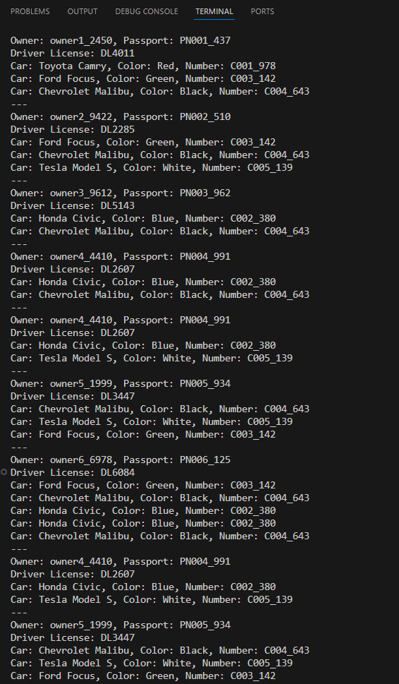
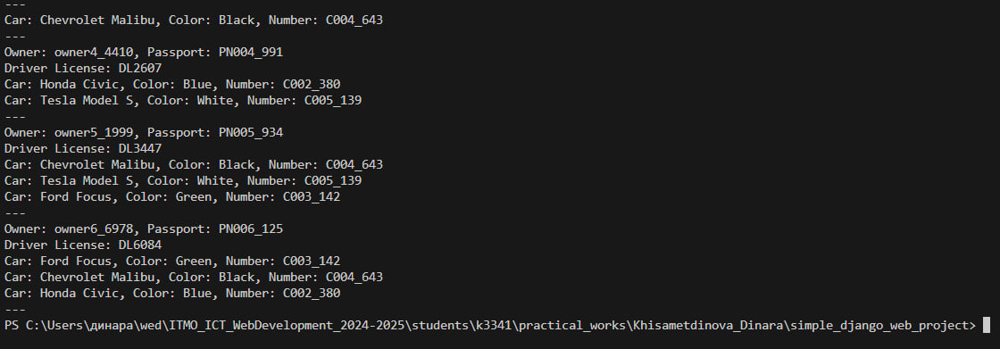

# Django Web framework. Запросы и их выполнение.

## Задача 1. Создание объектов
Напишите запрос на создание 6-7 новых автовладельцев и 5-6 автомобилей, каждому автовладельцу назначьте удостоверение и от 1 до 3 автомобилей. Задание можете выполнить либо в интерактивном режиме интерпретатора, либо в отдельном python-файле. Результатом должны стать запросы и отображение созданных объектов. 

Если вы добавляете автомобили владельцу через метод .add(), не забудьте заполнить также
ассоциативную сущность “владение”

## Решение
После тестирования работы в Django shell, было решено написать все запросы в формате скрипта для упрощения отладки и проверки решения.

```python
import os
import sys
import django
import random
from datetime import datetime, timedelta

BASE_DIR = os.path.dirname(os.path.dirname(os.path.abspath(__file__)))
sys.path.append(BASE_DIR)

os.environ.setdefault('DJANGO_SETTINGS_MODULE', 'simple_django_web_project.settings')

django.setup()

from project_first_app.models import CarOwner, DriverLicense, Car, CarOwnership


def generate_data():
    owners_data = [
        {'username': f'owner1_{random.randint(1000, 9999)}', 'passport_number': f'PN001_{random.randint(100, 999)}', 'home_address': 'Hollywood', 'nationality': 'CountryX'},
        {'username': f'owner2_{random.randint(1000, 9999)}', 'passport_number': f'PN002_{random.randint(100, 999)}', 'home_address': 'Beverly Hills', 'nationality': 'CountryY'},
        {'username': f'owner3_{random.randint(1000, 9999)}', 'passport_number': f'PN003_{random.randint(100, 999)}', 'home_address': 'New York', 'nationality': 'CountryZ'},
        {'username': f'owner4_{random.randint(1000, 9999)}', 'passport_number': f'PN004_{random.randint(100, 999)}', 'home_address': 'Los Angeles', 'nationality': 'CountryX'},
        {'username': f'owner5_{random.randint(1000, 9999)}', 'passport_number': f'PN005_{random.randint(100, 999)}', 'home_address': 'Chicago', 'nationality': 'CountryY'},
        {'username': f'owner6_{random.randint(1000, 9999)}', 'passport_number': f'PN006_{random.randint(100, 999)}', 'home_address': 'Houston', 'nationality': 'CountryZ'}
    ]

    owners = []
    for owner_data in owners_data:
        owner = CarOwner.objects.create_user(
            username=owner_data['username'],
            passport_number=owner_data['passport_number'],
            home_address=owner_data['home_address'],
            nationality=owner_data['nationality'],
            birth_date = datetime.now() - timedelta(days=random.randint(10000, 20000))
        )
        owners.append(owner)

        DriverLicense.objects.create(
            owner=owner,
            number=f'DL{random.randint(1000, 9999)}',
            type_id='B',
            issue_date=datetime.now() - timedelta(days=random.randint(1000, 3000))
        )

    cars_data = [
        {'number': f'C001_{random.randint(100, 999)}', 'brand': 'Toyota', 'model': 'Camry', 'color': 'Red'},
        {'number': f'C002_{random.randint(100, 999)}', 'brand': 'Honda', 'model': 'Civic', 'color': 'Blue'},
        {'number': f'C003_{random.randint(100, 999)}', 'brand': 'Ford', 'model': 'Focus', 'color': 'Green'},
        {'number': f'C004_{random.randint(100, 999)}', 'brand': 'Chevrolet', 'model': 'Malibu', 'color': 'Black'},
        {'number': f'C005_{random.randint(100, 999)}', 'brand': 'Tesla', 'model': 'Model S', 'color': 'White'}
    ]

    cars = []
    for car_data in cars_data:
        car = Car.objects.create(
            number=car_data['number'],
            brand=car_data['brand'],
            model=car_data['model'],
            color=car_data['color']
        )
        cars.append(car)

    for owner in owners:
        assigned_cars = random.sample(cars, random.randint(1, 3))  
        for car in assigned_cars:
            CarOwnership.objects.create(
                car=car,
                owner=owner,
                start_date=datetime.now() - timedelta(days=random.randint(500, 1000)),
                end_date=None
            )

    for owner in owners:
        print(f'Owner: {owner.username}, Passport: {owner.passport_number}')
        
        driver_license = owner.driverlicense_set.first()
        if driver_license:
            print('Driver License:', driver_license.number)
        else:
            print('Driver License: Not assigned')
        
        for ownership in CarOwnership.objects.filter(owner=owner):
            print(f'Car: {ownership.car.brand} {ownership.car.model}, Color: {ownership.car.color}, Number: {ownership.car.number}')
        print('---')

generate_data()
```
### 1. Настройка Django
- `BASE_DIR`: Определяет корневую директорию проекта.
- `sys.path.append(BASE_DIR)`: Добавляет корневую директорию в пути поиска модулей Python.
- `os.environ.setdefault`:  Устанавливает переменную окружения для указания Django, где найти настройки проекта.
- `django.setup()`: Инициализирует Django, чтобы можно было использовать его модели и ORM.

### 2. Генерация данных для автовладельцев
- `owners_data`: Список данных для автовладельцев. Генерирует случайные значения username и passport_number для уникальности. Остальные поля, такие как home_address и nationality, имеют фиксированные значения.

### 3. Сщздание автовладельцев
- Цикл проходит по списку `owners_data`.
- `CarOwner.objects.create_user`: Создает записи автовладельцев в базе данных.
- `birth_date`: Вычисляется как случайная дата рождения, примерно 27–55 лет назад.

### 4. Создание водительских удостоверений

Для каждого автовладельца создается водительское удостоверение.
`number`: Случайный номер удостоверения.
`issue_date`: Устанавливается как случайная дата выдачи удостоверения в прошлом.

### 5. Генерация данных для автомобиля
- `cars_data`: Список автомобилей с фиксированными марками, моделями и цветами. Номер автомобиля (`number`) содержит случайный суффикс для уникальности.

### 6. Создание автомобилей
- Цикл проходит по `cars_data` и создает записи автомобилей в базе данных.

### 7. Привязка автомобилей к владельцам
- random.sample(cars, random.randint(1, 3)): Назначает случайному владельцу от 1 до 3 автомобилей.
- `CarOwnership.objects.create`: Создает запись о владении автомобилем.
    - `start_date`: Устанавливается как случайная дата начала владения (примерно 1–3 года назад).
    - `end_date`: Устанавливается как None (текущее владение).

### 8. Вывод
- Выводит информацию о каждом владельце:
    - Имя и номер паспорта.
    - Водительское удостоверение (номер).
    - Список автомобилей, которыми он владеет (марка, модель, цвет, номер).


