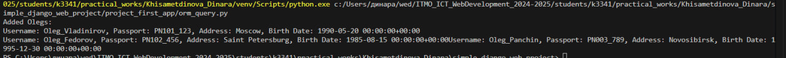

# Django Web framework. Запросы и их выполнение.

## Задача 2. Запросы на фильтрацию
- Где это необходимо, добавьте related_name к полям модели
- Выведете все машины марки “Toyota” (или любой другой марки, которая у вас есть)
- Найти всех водителей с именем “Олег” (или любым другим именем на ваше усмотрение)
- Взяв любого случайного владельца получить его id, и по этому id получить экземпляр удостоверения в виде объекта модели (можно в 2 запроса)
- Вывести всех владельцев красных машин (или любого другого цвета, который у вас присутствует)
- Найти всех владельцев, чей год владения машиной начинается с 2010 (или любой другой год, который присутствует у вас в базе)

## Решение
Cкрипт предназначен для добавления в базу данных трёх пользователей (автовладельцев) с именем "Олег", уникальными паспортными данными, адресами и датами рождения. Скрипт учитывает временные зоны для полей с типом `DateTimeField`, что позволяет избежать ошибок при активной поддержке временных зон в Django.

### 1. Настройка Django
В начале скрипта происходит настройка Django, чтобы скрипт мог работать в контексте вашего проекта:
- `BASE_DIR`: Определяет корневую директорию проекта.
- `sys.path.append(BASE_DIR)`: Добавляет корневую директорию в системные пути Python, чтобы импортировать модули проекта.
- `os.environ.setdefault`: Указывает файл настроек проекта Django.
- `django.setup`(): Инициализирует Django для работы со скриптом. 
  
### 2. Создание данных для Олегов
Скрипт создаёт три экземпляра модели CarOwner с уникальными данными. Для поля birth_date используется утилита make_aware, чтобы создать корректные значения дат с временной зоной:
Каждому "Олегу" присваиваются:

- Уникальное имя пользователя (username).
- Уникальный номер паспорта (passport_number).
- Уникальный адрес (home_address).
- Национальность (nationality).
- Дата рождения (birth_date).
- Для создания записей используется метод `create_user`.

### 3. Функция добавления записей в базу данных
Основной функционал добавлен в функцию add_olegs, чтобы скрипт можно было легко переиспользовать. Эта функция:

- Создаёт данные для трёх пользователей с именем "Олег".
- Добавляет их в базу данных.
- Выводит данные в консоль для проверки.
- Для полей типа `DateTimeField` используется утилита `make_aware` из `Django`, чтобы избежать ошибок с "наивными" датами.
  
### 4. Вот код скрипта:

```python
import os
import sys
from datetime import datetime
from django.utils.timezone import make_aware
import django

BASE_DIR = os.path.dirname(os.path.dirname(os.path.abspath(__file__)))
sys.path.append(BASE_DIR)
os.environ.setdefault('DJANGO_SETTINGS_MODULE', 'simple_django_web_project.settings')
django.setup()

from project_first_app.models import CarOwner

def add_olegs():
    birth_date_1 = make_aware(datetime(1990, 5, 20))
    birth_date_2 = make_aware(datetime(1985, 8, 15))
    birth_date_3 = make_aware(datetime(1995, 12, 30))

    oleg1 = CarOwner.objects.create_user(
        username="Oleg_Vladinirov", 
        passport_number="PN101_123", 
        home_address="Moscow", 
        nationality="Russian", 
        birth_date=birth_date_1
    )

    oleg2 = CarOwner.objects.create_user(
        username="Oleg_Fedorov", 
        passport_number="PN102_456", 
        home_address="Saint Petersburg", 
        nationality="Russian", 
        birth_date=birth_date_2
    )

    oleg3 = CarOwner.objects.create_user(
        username="Oleg_Panchin", 
        passport_number="PN003_789", 
        home_address="Novosibirsk", 
        nationality="Russian", 
        birth_date=birth_date_3
    )

    print("Added Olegs:")
    for oleg in [oleg1, oleg2, oleg3]:
        print(f"Username: {oleg.username}, Passport: {oleg.passport_number}, Address: {oleg.home_address}, Birth Date: {oleg.birth_date}")

if __name__ == "__main__":
    add_olegs()
```
### 5. Вывод в консоли

