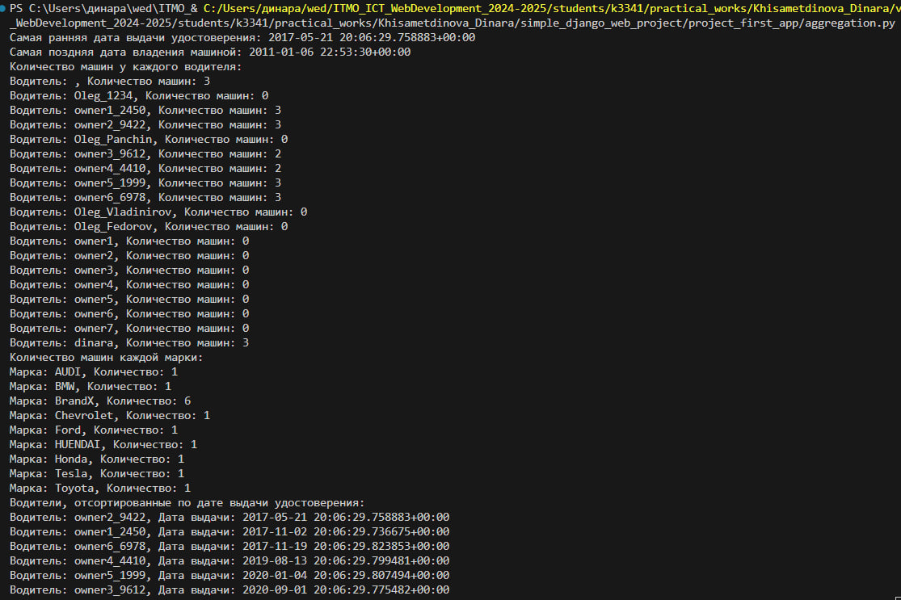

# Django Web framework. Запросы и их выполнение.

## Задача 2. Запросы на аггрегацию и аннотацию.
Необходимо реализовать следующие запросы c применением описанных методов:
- Вывод даты выдачи самого старшего водительского удостоверения
- Укажите самую позднюю дату владения машиной, имеющую какую-то из существующих моделей в вашей базе
- Выведите количество машин для каждого водителя
- Подсчитайте количество машин каждой марки
- Отсортируйте всех автовладельцев по дате выдачи удостоверения (Примечание: чтобы не выводить несколько раз одни и те же таблицы воспользуйтесь методом .distinct())
  
## Решение

```python
import os
import sys
from django.db.models import Count, Max, Min
import django

BASE_DIR = os.path.dirname(os.path.dirname(os.path.abspath(__file__)))
sys.path.append(BASE_DIR)
os.environ.setdefault('DJANGO_SETTINGS_MODULE', 'simple_django_web_project.settings')
django.setup()

from project_first_app.models import CarOwner, DriverLicense, Car, CarOwnership

def execute_queries():
    oldest_license = DriverLicense.objects.aggregate(Min('issue_date'))
    print(f"Самая ранняя дата выдачи удостоверения: {oldest_license['issue_date__min']}")

    latest_ownership = CarOwnership.objects.filter(
        car__model__isnull=False
    ).aggregate(Max('end_date'))
    print(f"Самая поздняя дата владения машиной: {latest_ownership['end_date__max']}")

    car_count_per_driver = CarOwner.objects.annotate(car_count=Count('ownerships__car'))
    print("Количество машин у каждого водителя:")
    for owner in car_count_per_driver:
        print(f"Водитель: {owner.username}, Количество машин: {owner.car_count}")

    car_count_per_brand = Car.objects.values('brand').annotate(count=Count('id'))
    print("Количество машин каждой марки:")
    for car in car_count_per_brand:
        print(f"Марка: {car['brand']}, Количество: {car['count']}")

    sorted_owners = DriverLicense.objects.select_related('owner').order_by('issue_date').distinct()
    print("Водители, отсортированные по дате выдачи удостоверения:")
    for license in sorted_owners:
        print(f"Водитель: {license.owner.username}, Дата выдачи: {license.issue_date}")

if __name__ == "__main__":
    execute_queries()
```
## Описание запросов

### Задача 1. Дата выдачи самого старшего водительского удостоверения
Используется метод aggregate с функцией `Min`, чтобы найти минимальную дату в поле `issue_date` модели `DriverLicense`:

```python
oldest_license = DriverLicense.objects.aggregate(Min('issue_date'))
```
### Задача 2. Самая поздняя дата владения машиной
Фильтруем записи `CarOwnership`, у которых есть модель автомобиля `(model__isnull=False)`, и используем aggregate с `Max` для получения самой поздней даты окончания владения:

```python
latest_ownership = CarOwnership.objects.filter(car__model__isnull=False).aggregate(Max('end_date'))
```
### Задача 3. Количество машин для каждого водителя
Используется `annotate` и `Count` для подсчёта связанных машин для каждого водителя через поле `ownerships`:

```python
car_count_per_driver = CarOwner.objects.annotate(car_count=Count('ownerships__car'))
```
### Задача 4. Количество машин каждой марки
Используется метод values для группировки по brand и подсчёта количества машин через `annotate`:
```python
car_count_per_brand = Car.objects.values('brand').annotate(count=Count('id'))
```
### Задача 5. Сортировка автовладельцев по дате выдачи удостоверения
Используется метод `select_related` для объединения с моделью `CarOwner` и `order_by` для сортировки:
```python
sorted_owners = DriverLicense.objects.select_related('owner').order_by('issue_date').distinct()
```
### Вывод в консоли:
