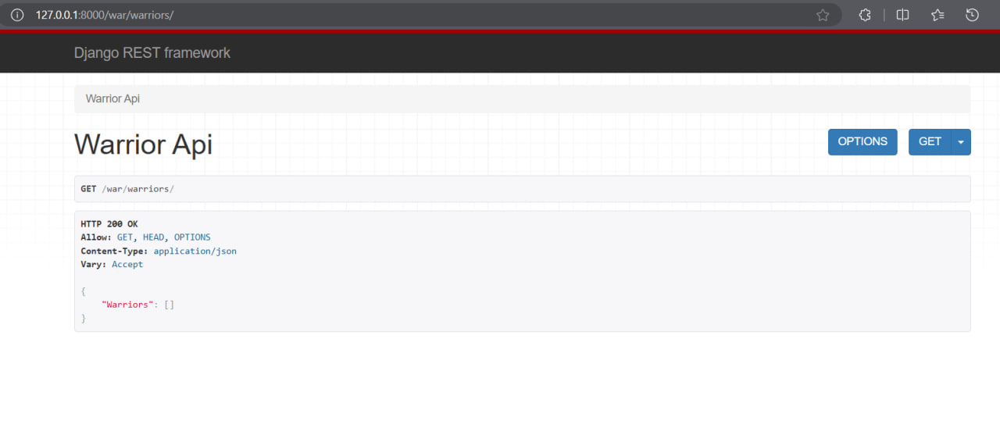
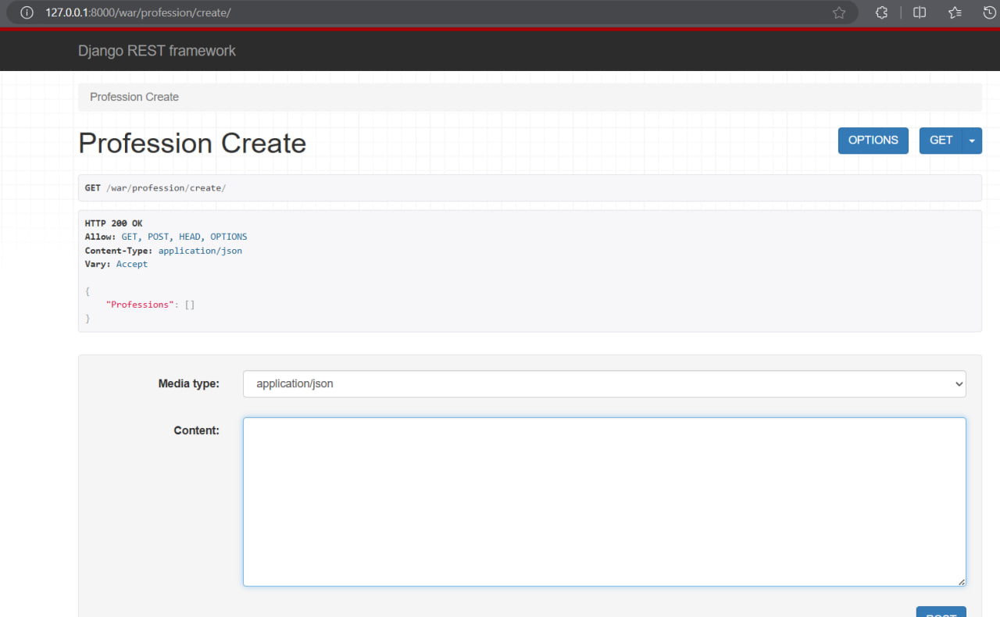
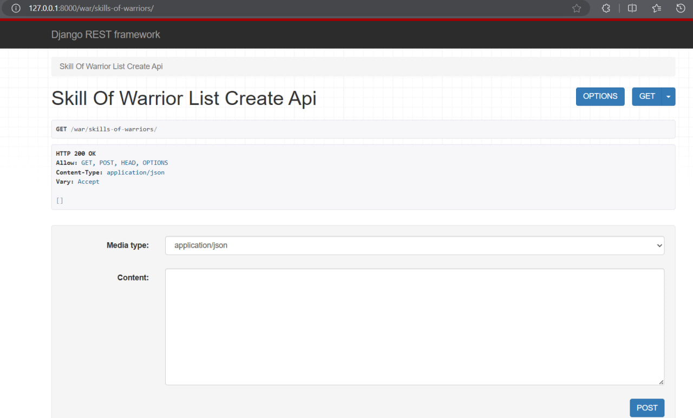
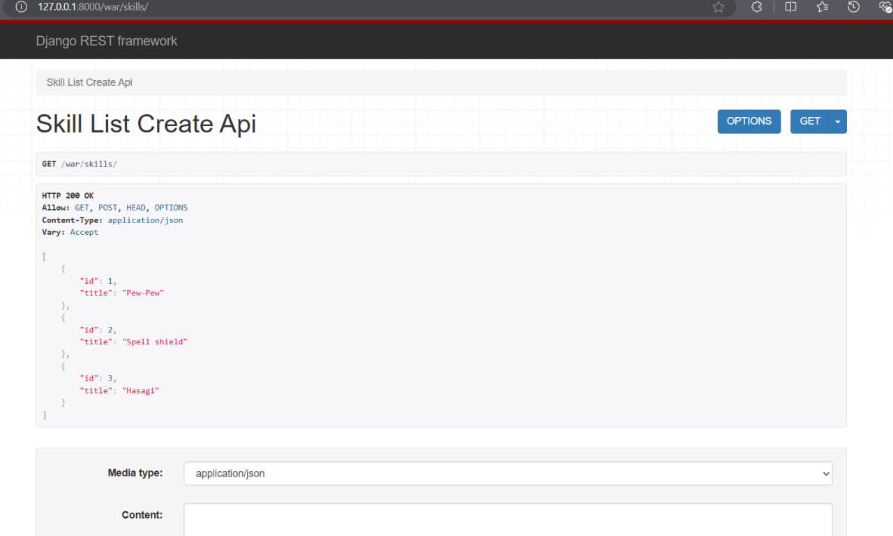

# Django Rest framework. Представления на основе APIView.

## Задача. 
Реализовать ендпоинты для добавления и просмотра скилов методом, описанным в пункте выше (APIView).

## Решение
Для реализации эндпоинтов для добавления и просмотра скиллов с использованием подхода с APIView, можно создать два представления: одно для работы с моделью Skill, и другое для работы с моделью SkillOfWarrior.

### `serializers.py`
```python
from rest_framework import serializers
from .models import *

class WarriorSerializer(serializers.ModelSerializer):

  class Meta:
     model = Warrior
     fields = "__all__"

class ProfessionCreateSerializer(serializers.ModelSerializer):

    class Meta:
        model = Profession
        fields = "__all__"

class SkillSerializer(serializers.ModelSerializer):

    class Meta:
        model = Skill
        fields = "__all__"       

class SkillOfWarriorSerializer(serializers.ModelSerializer):
    class Meta:
        model = SkillOfWarrior
        fields = "__all__"
```


### `views.py`
Ещё добавила коды ошибок

```python
from django.shortcuts import render
from rest_framework.views import APIView
from rest_framework.response import Response
from rest_framework import status
from .serializers import *

class WarriorAPIView(APIView):
   def get(self, request):
       warriors = Warrior.objects.all()
       serializer = WarriorSerializer(warriors, many=True)
       return Response({"Warriors": serializer.data})
   
class ProfessionCreateView(APIView):

    def get(self, request):
        professions = Profession.objects.all()
        serializer = ProfessionCreateSerializer(professions, many=True)
        return Response({"Professions": serializer.data})
   
    def post(self, request):
        profession = request.data.get("profession")
        serializer = ProfessionCreateSerializer(data=profession)
        if serializer.is_valid(raise_exception=True):
           profession_saved = serializer.save()
        return Response({"Success": f"Profession '{profession_saved.title}' created successfully."})
    
class SkillListCreateAPIView(APIView):
   
    def get(self, request):
        skills = Skill.objects.all()
        serializer = SkillSerializer(skills, many=True)
        return Response(serializer.data, status=status.HTTP_200_OK)

    def post(self, request):
        serializer = SkillSerializer(data=request.data)
        if serializer.is_valid():
            serializer.save()
            return Response(serializer.data, status=status.HTTP_201_CREATED)
        return Response(serializer.errors,  status=status.HTTP_400_BAD_REQUEST)
       
class SkillOfWarriorListCreateAPIView(APIView):
    
    def get(self, request):
        skills_of_warriors = SkillOfWarrior.objects.all()
        serializer = SkillOfWarriorSerializer(skills_of_warriors, many=True)
        return Response(serializer.data, status=status.HTTP_200_OK)

    def post(self, request):
        serializer = SkillOfWarriorSerializer(data=request.data)
        if serializer.is_valid():
            serializer.save()
            return Response(serializer.data, status=status.HTTP_201_CREATED)
        return Response(serializer.errors, status=status.HTTP_400_BAD_REQUEST)
```

### `urls.py`

```python
from django.urls import path
from .views import WarriorAPIView, ProfessionCreateView, SkillListCreateAPIView, SkillOfWarriorListCreateAPIView

app_name = "warriors_app"

urlpatterns = [
   path('warriors/', WarriorAPIView.as_view()),
   path('profession/create/', ProfessionCreateView.as_view()),
   path('skills/', SkillListCreateAPIView.as_view(), name='skill-list-create'),
   path('skills-of-warriors/', SkillOfWarriorListCreateAPIView.as_view(), name='skill-of-warrior-list-create'),
]
```

### Результаты




