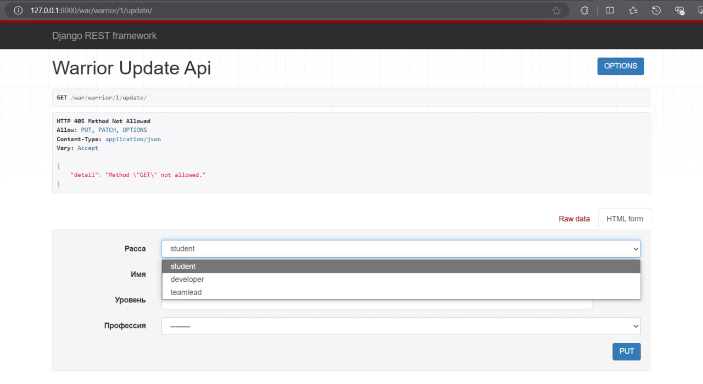

# Django Rest framework. Представления на основе Generic Views.

## Задача. 
Реализовать ендпоинты:
- Вывод полной информации о всех войнах и их профессиях (в одном запросе).
- Вывод полной информации о всех войнах и их скилах (в одном запросе).
- Вывод полной информации о войне (по id), его профессиях и скилах.
- Удаление война по id.
- Редактирование информации о войне.


### `serializers.py`
Использую Serializer с вложенными данными:
```python
from rest_framework import serializers
from .models import *

class WarriorSerializer(serializers.ModelSerializer):

  class Meta:
     model = Warrior
     fields = "__all__"

class ProfessionCreateSerializer(serializers.ModelSerializer):

    class Meta:
        model = Profession
        fields = "__all__"

class SkillSerializer(serializers.ModelSerializer):

    class Meta:
        model = Skill
        fields = "__all__"       

class SkillOfWarriorSerializer(serializers.ModelSerializer):
    skill = SkillSerializer()
    class Meta:
        model = SkillOfWarrior
        fields = ["skill", "level"]

class WarriorWithProfessionsSerializer(serializers.ModelSerializer):
    profession = ProfessionCreateSerializer(many=True)

    class Meta:
        model = Warrior
        fields = "__all__"

class WarriorWithSkillsSerializer(serializers.ModelSerializer):
    skillsofwarrior_set = SkillOfWarriorSerializer(many=True)

    class Meta:
        model = Warrior
        fields = "__all__"

class WarriorDetailSerializer(serializers.ModelSerializer):
    profession = ProfessionCreateSerializer(many=True)
    skillsofwarrior_set = SkillOfWarriorSerializer(many=True)

    class Meta:
        model = Warrior
        fields = "__all__"
```

### `views.py`

Дописала класс с представлениями.
```python
class WarriorsWithProfessionsListAPIView(generics.ListAPIView):
    serializer_class = WarriorWithProfessionsSerializer
    queryset = Warrior.objects.all()

class WarriorsWithSkillsListAPIView(generics.ListAPIView):
    serializer_class = WarriorWithSkillsSerializer
    queryset = Warrior.objects.all()

class WarriorDetailAPIView(generics.RetrieveAPIView):
    serializer_class = WarriorDetailSerializer
    queryset = Warrior.objects.all()

class WarriorDeleteAPIView(generics.DestroyAPIView):
    queryset = Warrior.objects.all()

class WarriorUpdateAPIView(generics.UpdateAPIView):
    serializer_class = WarriorSerializer
    queryset = Warrior.objects.all()
```

### `urls.py`

```python
from django.urls import path
from .views import (
    WarriorAPIView,
    ProfessionCreateView,
    SkillListCreateAPIView,
    SkillOfWarriorListCreateAPIView,
    WarriorsWithProfessionsListAPIView,
    WarriorsWithSkillsListAPIView,
    WarriorDetailAPIView,
    WarriorDeleteAPIView,
    WarriorUpdateAPIView,
)


app_name = "warriors_app"

urlpatterns = [
   path('warriors/', WarriorAPIView.as_view()),
   path('profession/create/', ProfessionCreateView.as_view()),
   path('skills/', SkillListCreateAPIView.as_view(), name='skill-list-create'),
   path('skills-of-warriors/', SkillOfWarriorListCreateAPIView.as_view(), name='skill-of-warrior-list-create'),
   path('warriors/professions/', WarriorsWithProfessionsListAPIView.as_view(), name='warriors-with-professions'),
   path('warriors/skills/', WarriorsWithSkillsListAPIView.as_view(), name='warriors-with-skills'),
   path('warrior/<int:pk>/', WarriorDetailAPIView.as_view(), name='warrior-detail'),
   path('warrior/<int:pk>/delete/', WarriorDeleteAPIView.as_view(), name='warrior-delete'),
   path('warrior/<int:pk>/update/', WarriorUpdateAPIView.as_view(), name='warrior-update'),
]
```

### Тестирование:
- Вывод всех войнов и их профессий:
GET /warriors/professions/

- Вывод всех войнов и их скилов:
GET /warriors/skills/

- Вывод информации о войне по id:
GET /warrior/<id>/

- Удаление война по id:
DELETE /warrior/<id>/delete/

- Редактирование информации о войне:
PUT /warrior/<id>/update/

Запрос:
```json
{
    "name": "Updated Warrior Name",
    "race": "Updated Race"
}
```

### Результат


